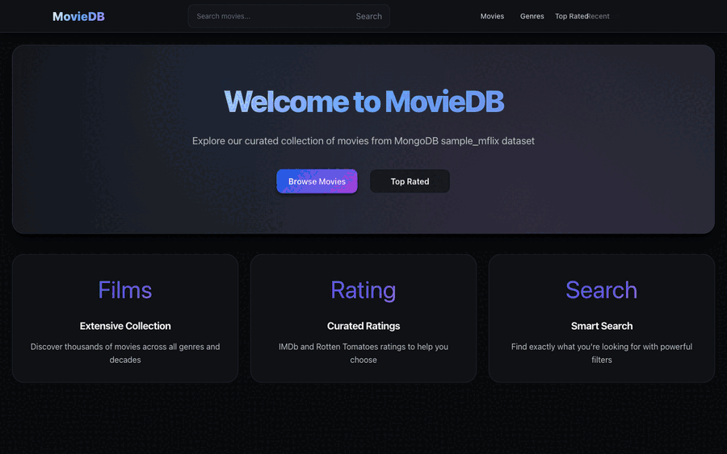

# FastAPI MongoDB Movies

Full-stack movie application with a FastAPI backend, MongoDB data access via Motor, and a React + TypeScript frontend.

## Demo


The demo above shows navigation across the app, movie search, movie details, and scrolling to the bottom of a movie-details session.

## Current Project State
- Layered backend architecture: `API -> Service -> Repository -> Database`
- Async MongoDB access with connection pooling via Motor
- React frontend with route transitions using Framer Motion
- Feature routes for movies, genres, top-rated, recent, and about pages
- Admin API for poster validation jobs and job status management
- Python and frontend tests in `tests/` and `frontend` test setup

## Tech Stack
- Backend: FastAPI, Motor, Pydantic v2, Uvicorn
- Frontend: React 18, TypeScript, React Router, Framer Motion, CSS Modules
- Tooling: `uv` for Python dependency/runtime management, npm for frontend
- Database: MongoDB (`sample_mflix`-style collections)

## Repository Structure
```text
fastapi-mongo-movies/
├── backend/
│   ├── api/                # FastAPI app + route modules
│   │   └── routes/         # movies, users, comments, admin
│   ├── services/           # Business logic layer
│   ├── repositories/       # Data access layer
│   ├── schemas/            # Pydantic request/response schemas
│   └── core/               # Config, DB manager, logging, exceptions
├── frontend/
│   ├── src/
│   │   ├── components/     # Domain + UI components
│   │   ├── styles/         # CSS modules
│   │   ├── services/       # API client layer
│   │   └── utils/          # Frontend utilities
│   └── package.json
├── scripts/                # Utility scripts (indexes, validation helpers)
├── tests/                  # Backend and frontend-oriented tests
├── docker-compose.yml
├── docker-compose.prod.yml
└── main.py                 # Local service launcher
```

## Prerequisites
- Python `3.12+`
- Node.js `16+` (npm)
- MongoDB instance with movie/user/comment data
- `uv` installed

## Setup
```bash
# Install backend dependencies
uv sync

# Install test extras (optional but recommended)
uv sync --group test

# Install frontend dependencies
cd frontend && npm install && cd ..
```

## Configuration
Create `.env` in repo root.

Required database settings:
```env
DB_HOST=
DB_NAME=
DB_USER=
DB_PASS=
```

Common optional settings:
```env
MONGODB_TLS=true
MONGODB_TLS_ALLOW_INVALID_CERTS=true
MONGODB_CONNECTION_TIMEOUT=10
MONGODB_MAX_POOL_SIZE=10

LOG_LEVEL=INFO
LOG_TO_CONSOLE=true
LOG_TO_FILE=true
```

## Run Locally

Run backend + frontend together:
```bash
uv run main.py -bf
```

Run only backend:
```bash
uv run main.py -b
```

Run only frontend:
```bash
uv run main.py -f
```

Key local URLs:
- Frontend: `http://localhost:3000`
- Backend API: `http://localhost:8000`
- OpenAPI docs: `http://localhost:8000/docs`
- ReDoc: `http://localhost:8000/redoc`
- Health check: `http://localhost:8000/health`

## API Surface (Summary)

Movies (`/movies`)
- `GET /movies/`
- `GET /movies/{movie_id}`
- `GET /movies/genres`
- `GET /movies/genres/{movie_genre}`
- `GET /movies/types`
- `GET /movies/types/{movie_type}`
- `GET /movies/year/{year}`
- `GET /movies/rating/{rating}`

Users (`/users`)
- `GET /users/`
- `GET /users/{user_id}`
- `POST /users/`
- `GET /users/email/{email}`
- `GET /users/name/{name}`

Comments (`/comments`)
- `GET /comments/`
- `GET /comments/{comment_id}`
- `GET /comments/movie/{movie_id}`
- `GET /comments/email/{email}`
- `GET /comments/name/{name}`

Admin (`/admin`)
- `POST /admin/movies/validate-posters`
- `GET /admin/movies/validate-posters/{job_id}`
- `GET /admin/movies/validate-posters/statistics`
- `GET /admin/movies/validate-posters/invalid`
- `POST /admin/movies/{movie_id}/validate-poster`
- `POST /admin/movies/validate-posters/revalidate/{movie_id}`
- `DELETE /admin/jobs/{job_id}`

For exact schemas and query params, use `http://localhost:8000/docs`.

## Frontend Routes
- `/` home
- `/movies`
- `/movie/:movieId`
- `/genres`
- `/genres/:genre`
- `/top-rated`
- `/recent`
- `/about`
- `/debug`

Development-only routes are also available in development mode (`/dev`, `/spinners-test`).

## Testing
Backend tests:
```bash
uv run pytest
```

Frontend tests:
```bash
cd frontend && npm test
```

Coverage output is configured in `pyproject.toml` (terminal + `htmlcov` + `coverage.xml`).

## Docker
Development stack:
```bash
docker-compose up -d
```

Production stack:
```bash
docker-compose -f docker-compose.prod.yml up -d
```

See `DOCKER.md` for details.

## Troubleshooting
- If frontend is unreachable, verify `npm --prefix frontend start` is running (or start via `uv run main.py -bf`).
- If API calls fail, confirm backend health at `http://localhost:8000/health`.
- If Mongo connection fails, re-check `DB_HOST`, `DB_NAME`, `DB_USER`, `DB_PASS` and TLS settings in `.env`.
- For logs, inspect `logs/app.log` and `logs/errors.log`.
